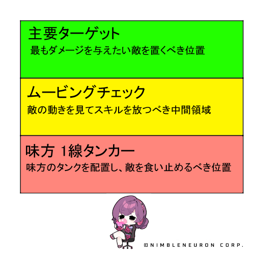

# ニアのロール
## 瞬間火力（ヌーキング）型ディーラー
優れたエリア制圧能力と高い継続火力を持ち、ブルーザーや遠距離ディーラーを圧倒するキャラ

# スキル説明
## Q
射程：7m ダメージエリア：半径1.5m  
指定した場所にブロックを設置します。  
命中時、Wのクールタイムが減少します。最大3つまで生成可能です。

## W
射程7.5m ダメージエリア：半径2m  
指定した場所に床を設置し、命中した敵を中心へ引き寄せます。最大1つまで生成可能です。  
Wの黄色い線の範囲内にQがある場合、QはWの位置まで引き寄せられダメージを与えます。  
WにQが到着すると再びダメージを与えます。  
Wに引き寄せられるQが命中した際、Qのクールタイムが減少します。クールタイム減少はQ1つにつき1回のみ適用されます。  

## E
持続時間：2.5s  
Eの状態で死亡しても、倒れずに一定時間無敵状態となり、体力と移動速度が増加します。  
ニアの移動スキルの代わりとなる生存スキルです。

## R
ゲームワールド作成場所：ニアの1m前  
ゲームワールドサイズ：10m×10m  
持続時間：6s  
持続効果：スキルを命中させるたびにバッテリースタックを獲得します。究極技（R）使用時、バッテリースタックに比例してシールドを得ます。  
使用時、前方にゲームワールドを生成し、集中詠唱、全ての妨害への無効状態になります。  
Rの壁に触れると短い気絶を与え、移動スキルを中断させます。  
Rの状態では、スキルの発動範囲がRの中に制限されますが、Qの基本クールタイムが減少します。  
スキルダメージを与えるたびにRの持続時間が増え、8回ダメージを与えるごとにR範囲内に追加ダメージを与えます。  

## T
90(＋スキル増幅比例) ＋ (スタック数) x 10(＋スキル増幅比例)。  
敵にダメージを与えるたびにKOスタックを付与し、スタックごとにダメージ量を蓄積します。  
蓄積されたダメージ量が相手の体力より多くなると「処刑」します。  

# スキル活用のヒント
- Q命中時にWのクールタイム減少、移動するQの命中時にQのクールタイム減少。Wが設置された状態でQを命中させると、QとWのクールタイムが同時に減少します。
- Rの状態でもEを使用することができます。

# 戦闘Tips
- Qを置き続ける  
対峙している時に最も重要なのは、Qが溜まり次第、継続的に設置することです。  
当たろうが当たるまいが、まずはQを投げることが大切です。  
Wで設置済みのQを引き寄せ、瞬間的な爆発ダメージを与えられるようにします。  

- Wの設置位置について  
相手の移動スキルの位置を予測して冷静に設置  

- 究極技の発動角度（ポジション）について  
緑色のエリアに狙うべき敵を配置し、赤色のエリアに味方のメインタンクを配置するのが理想的です。  
相手が黄色のエリアにいる場合は、相手の動きを見てスキルを放ちます。  
状況によって異なる場合もありますが、最も重要なのは緑色のエリアに敵を捉えることです。  

- 仕掛ける？カウンター？  
ニアは先制攻撃を受けると非常に脆いです。そのため、距離の調整（アウトレンジ）は絶対に欠かせません。  
ニアは先制されるべきではないキャラなので、必ずこちらから先に攻撃を仕掛けるのがベストです。  
もし味方が先制しにくい構成なら、ニア自身がある程度のリスクを負って先制攻撃を仕掛ける必要があります。  

- 構成(味方)  
ニッキー、ユキ、メインタンク（レノックスを除く）、ヒョヌなど、映像のように先陣を切って突っ込んでくれるキャラが味方にいると非常に戦いやすいです。  

- その他  
Rの使用中にEで耐えながらダメージを出したり、Rで相手チームを分断したりといったテクニックもあります  
